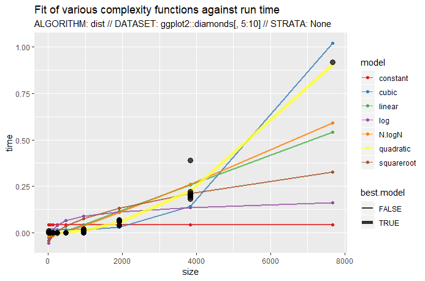

# GuessCompx

This package enables the R user to empirically **estimate the computation time and memory** usage of any algorithm **before fully running it**. The user's algorithm is run on an set of increasing-sizes small portions of his dataset. Various models are then fitted to **capture the computational complexity** trend likely to best fit the algorithm (independant o(1) , linear o(n) , quadratic o(n2), etc.), one for the time, another for the memory. The model eventually predicts the time and memory usage for the full size of the data.

Details on the subject of algorithmic complexity can be found on the [wikipedia page](http://en.wikipedia.org/wiki/Time_complexity). Note that the complexity is understood only with regard to the size of the data (number of rows), not other possible parameters such as number of features, tuning parameters, etc. Interactions with those parameters could be investigated in future versions of the package.

The complexity functions already implemented are the following:
*O(1), O(N), O(N^2), O(N^3), O(N^0.5), O(log(N)), O(N\*log(N))*

# How it works

Most algorithms out there have a complexity behaviour that does not change in time: some are independant of the number of rows (think of the `length` function), some linear, some quadratic (typically a distance computation), etc. We track the computation time & memory of runs of the algorithm on increasing subsets of the data, using sampling or stratified sampling if needed. We fit the various complexity functions with a simple `glm()` procedure with a formula of the kind `glm(time ~ log(nb_rows))`, then find which is the best fit to the data. This comparison between the models is achieved through a LOO (**leave-one-out**) routine using Mean Squared Error as the indicator. 

The `GuessCompx` package has a single entry point: the `CompEst()` function that accept diverse input formats (data.frame, matrix, time series) and is fully configurable to fit most use cases: which size of data to start at, how much time you have to do the audit (usually 1 minute gives a good result), how many replicates you want for each tested size (in case of high variability), do you need a stratified sampling (in case each run must include all possible categories of one variable), by how much we increase the size at each run, etc.

The plot output helps to compare the fit of each complexity function to the data. Here is an example:

## Imports

`GuessCompx` requires the following CRAN packages to be installed:
**`dplyr`, `reshape2`, `lubridate`, `ggplot2`, `boot`**

## Installation

The package will be submitted to CRAN and hopefully available there soon. Meanwhile, you can install the beta version of GuessCompx from Github:

``` r
# install.packages("devtools")
library(devtools)
install_github("agenis/GuessCompx")
library(GuessCompx)
?CompEst
```

## Example

Here, `CompEst()` is used to show the quadratic complexity of the `dist()` function:

```{r example}
CompEst(d = ggplot2::diamonds[, 5:10], f = dist, replicates = 10, max.time = 10)
```

And an output plot:

